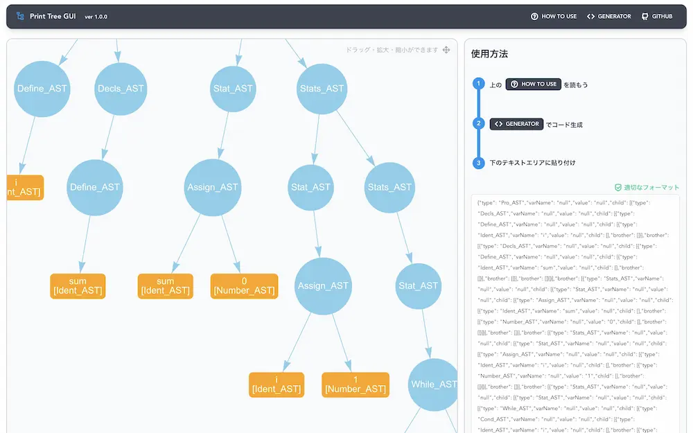

# これは何をするサイトなの？
情報工学実験C（ソフトウェア）のアセンブラ講義で作成する木構造を、グラフィカルに出力します。

[こちらのサイト](https://print-tree-gui.vercel.app/) でデモを確認できます。

> https://print-tree-gui.vercel.app

# License
This project is licensed under the MIT License - see LICENSE for details.

Copyright © 2022 Developed by smpny7.
